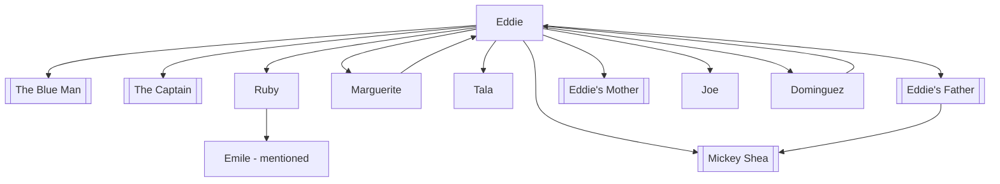

# 02 - Characters MOC

> *"Strangers are just family you have yet to come to know."*
> — [[The Blue Man]]

This note serves as the central hub for every character in the novel. Use the links below to explore each person's biography, role in the story, and connections to others.

## The Protagonist

| Character | Role | First Appearance |
|-----------|------|------------------|
| [[Eddie]] | Protagonist, maintenance worker at Ruby Pier | "The End" |

## The Five People Eddie Meets in Heaven

| # | Character | Real Name | Their Connection to Eddie | Lesson |
|---|-----------|-----------|---------------------------|--------|
| 1 | [[The Blue Man]] | Joseph Corvelzchik | Eddie caused the car accident that killed him as a child | [[Lesson 1 - Connection\|Connection]] |
| 2 | [[The Captain]] | (unnamed) | Eddie's commanding officer in WWII | [[Lesson 2 - Sacrifice\|Sacrifice]] |
| 3 | [[Ruby]] | Ruby | Namesake of Ruby Pier; witnessed Eddie's father's final days | [[Lesson 3 - Forgiveness\|Forgiveness]] |
| 4 | [[Marguerite]] | Marguerite | Eddie's beloved wife | [[Lesson 4 - Love\|Love]] |
| 5 | [[Tala]] | Tala | The child Eddie accidentally burned in the Philippines | [[Lesson 5 - Purpose\|Purpose]] |

## Supporting Characters

| Character | Relationship to Eddie | Role in the Story |
|-----------|----------------------|-------------------|
| [[Eddie's Father]] | Father | Abusive, silent, yet sacrificed his health for loyalty |
| [[Eddie's Mother]] | Mother | Source of tenderness; outlived her husband |
| [[Joe]] | Older brother | Salesman, more "successful" by worldly standards |
| [[Mickey Shea]] | Family friend / coworker | Drunken friend of the father; catalyst for father's death |
| [[Dominguez]] | Coworker at Ruby Pier | Young maintenance worker who inherits Eddie's job |
| [[Nicky]] | Stranger | The teenager whose lost car key caused the fatal accident |
| Willie | Coworker | Ride operator at Freddy's Free Fall |
| Noel | Friend | Eddie's gambling buddy |
| Mr. Bullock | Park owner | Owns Ruby Pier |
| Mr. Nathanson | Baker / landlord | Has a telephone; delivers bad news |

## Minor Characters

| Character | Notable For |
|-----------|-------------|
| Rabozzo | Fellow POW murdered by guards in the Philippines |
| Morton | Fellow POW, enthusiastic about burning the camp |
| Smitty | Fellow POW, quiet, from Brooklyn |
| Crazy One / Two / Three / Four | Enemy guards holding the Americans captive |
| Amy / Annie | The little girl Eddie dies trying to save at Ruby Pier |
| Emile | Ruby's husband; built Ruby Pier |

## Character Archetypes

- **The Everyman**: Eddie — represents ordinary people who feel their lives lack significance.
- **The Wounded Healer**: Each of the five people carries their own pain, yet they heal Eddie.
- **The Silent Father**: Eddie's father embodies generational trauma and the damage of unexpressed love.
