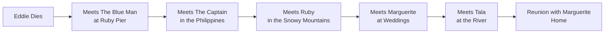

# 03 - The Five Lessons MOC

> *"This is the greatest gift God can give you: to understand what happened in your life. To have it explained. It is the peace you have been searching for."*
> — [[The Blue Man]]

This note summarizes the five lessons Eddie learns in heaven. Each lesson is taught by one of the five people he meets. Click any lesson to explore its full meaning, context, and real-world application.

## The Five Lessons at a Glance

| # | Teacher | Lesson | One-Sentence Summary |
|---|---------|--------|----------------------|
| 1 | [[The Blue Man]] | [[Lesson 1 - Connection\|Connection]] | All lives are connected; no act is random. |
| 2 | [[The Captain]] | [[Lesson 2 - Sacrifice\|Sacrifice]] | Sacrifice is part of life, not something to regret. |
| 3 | [[Ruby]] | [[Lesson 3 - Forgiveness\|Forgiveness]] | Holding anger is a poison that harms yourself. |
| 4 | [[Marguerite]] | [[Lesson 4 - Love\|Love]] | Lost love is still love; life ends, but love doesn't. |
| 5 | [[Tala]] | [[Lesson 5 - Purpose\|Purpose]] | Eddie's life had meaning because he kept children safe. |

## The Journey Through Heaven

## How the Lessons Build on Each Other

1. **Connection** sets the foundation — Eddie must understand that his life was never isolated.
2. **Sacrifice** explains the cost of those connections — his leg, the Captain's life, Rabozzo's death.
3. **Forgiveness** frees Eddie from the anger that has trapped him — especially toward his father.
4. **Love** restores what Eddie thought he had lost forever — his marriage to Marguerite.
5. **Purpose** reveals the ultimate meaning — his "meaningless" job saved thousands of children.

## Key Quotes by Lesson

> [!quote] Connection
> *"There are no random acts. That we are all connected. That you can no more separate one life from another than you can separate a breeze from the wind."*

> [!quote] Sacrifice
> *"Sometimes when you sacrifice something precious, you're not really losing it. You're just passing it on to someone else."*

> [!quote] Forgiveness
> *"Holding anger is a poison. It eats you from inside... hatred is a curved blade. And the harm we do, we do to ourselves."*

> [!quote] Love
> *"Lost love is still love, Eddie. It takes a different form, that's all... Life has to end. Love doesn't."*

> [!quote] Purpose
> *"Children. You keep them safe. You make good for me... Is where you were supposed to be, Eddie Main-ten-ance."*

## Related Notes

- [[04 - Plot Timeline]] — See when each lesson occurs in the narrative.
- [[05 - Key Quotes]] — More curated quotes organized by theme.
- [[06 - Study Guide]] — Test your understanding of each lesson.
