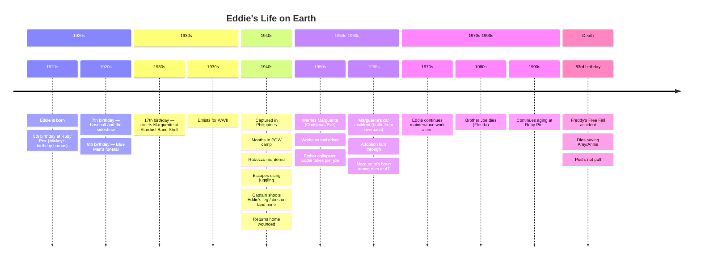

# 04 - Plot Timeline

This note presents the novel's events in two parallel tracks: **Eddie's Life on Earth** (chronological) and **Eddie's Journey Through Heaven** (the narrative present).

## Eddie's Life: Key Birthdays

| Age | Year (approx) | Event |
|-----|---------------|-------|
| Birth | 1920s | Born in city hospital |
| 5 | 1920s | Birthday at Ruby Pier; Mickey's "birthday bumps" |
| 7 | 1920s | Gets baseball; chases it into street (causes Blue Man's death) |
| 8 | 1920s | Birthday on day of Blue Man's funeral |
| 17 | ~1937 | Meets Marguerite; war news on radio |
| 20s | ~1940s | Goes to war; captured; escapes; wounded |
| 24 | ~1947 | Returns from war; in VA hospital |
| 33 | ~1956 | Nightmares; father dies; takes pier job |
| 37 | ~1960 | Breakfast with Noel; hears about Brighton accident |
| 38 | ~1961 | Marguerite's surprise birthday with children |
| 39 | ~1962 | Wins at racetrack; Marguerite's car accident |
| 47 | ~1970 | Marguerite dies of brain tumor |
| 51+ | 1970s+ | Birthdays alone; routine of maintenance |
| 83 | ~2003 | Dies at Ruby Pier |

## Eddie's Journey Through Heaven

| Stage | Setting | Person | Lesson |
|-------|---------|--------|--------|
| Death | Freddy's Free Fall | — | Feels two small hands |
| Arrival | Ruby Pier (1920s) | — | Young again, no pain |
| 1st Heaven | Sideshow / old pier | The Blue Man | Connection |
| 2nd Heaven | Philippine battlefield | The Captain | Sacrifice |
| 3rd Heaven | Snowy mountain diner | Ruby | Forgiveness |
| 4th Heaven | Wedding receptions | Marguerite | Love |
| 5th Heaven | River of children | Tala | Purpose |
| Reunion | Ferris wheel cart | Marguerite | Home |

## Narrative Structure in the Novel

The book does not follow chronological order. It alternates between three narrative strands:

1. **"The End"** — Real-time countdown of Eddie's last hour on Earth
2. **"Today Is Eddie's Birthday"** — Flashbacks to pivotal birthdays
3. **"The Journey"** — Eddie's progression through the five heavens

This structure mirrors the theme: **all times exist at once**, and understanding requires looking at the whole pattern, not just one moment.

## Related Notes

- [[00 - Home]] — Entry point
- [[Eddie]] — Protagonist deep-dive
- [[The Story Structure]] — Analysis of narrative techniques
- [[03 - The Five Lessons MOC]] — The five lessons
